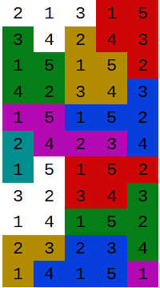

# ChocoSolver

Quelques exercices de CSP en ChocoSolver.

---

*Voir le ficher [readmeChocoSolver](./readmeChocoSolver.md) pour plus d'informations sur la librairie chocoSolver.*

---

### N Reines
Résolution du puzzle des n reines avec ChocoSolver.

- Placer n reines sur un échiquier de taille n x n de telle sorte qu'aucune reine ne puisse en attaquer une autre.

**Particularités :**
 - utilisation de contraintes arithmétiques, de allDifferents
 - différentes stratégies de recherche sont proposées.

♛⬜⬛⬜⬛⬜⬛⬜  
⬜⬛⬜⬛♛⬛⬜⬛  
⬛⬜⬛⬜⬛⬜⬛♛  
⬜⬛⬜⬛⬜♛⬜⬛  
⬛⬜♛⬜⬛⬜⬛⬜  
⬜⬛⬜⬛⬜⬛♛⬛  
⬛♛⬛⬜⬛⬜⬛⬜  
⬜⬛⬜♛⬜⬛⬜⬛  

Un code des N reines en ChocoSolver est disponible [ici](https://github.com/EmmanuelADAM/IntelligenceArtificielleJava/blob/master/progParContraintes/src/NQueens.java).

---

### Carré magique
Résolution du puzzle carré magique avec ChocoSolver.

- Dans un carré magique d'ordre n, on place les entiers de 1 à n² de telle sorte que la somme des nombres dans chaque ligne, chaque colonne et les deux diagonales soit la même.
- Cette somme constante, appelée constante magique, peut être calculée avec la formule : $M = n(n^2 + 1) / 2$.
  - pour un carré de 3x3, la constante magique est 15; pour un carré de 4x4, elle est 34, etc.
Exemple : 
<pre style="color:blue">
- -------------------
| 16 |  1 |  8 |  9 |
---------------------
|  2 |  7 | 10 | 15 |
---------------------
| 13 | 12 |  5 |  4 |
---------------------
|  3 | 14 | 11 |  6 |
---------------------
</pre>
**Particularités :** 
  - recopie d'une partie de tableau, 
  - somme de valeurs contraintes.

Un code MagicSquare en ChocoSolver est disponible [ici](https://github.com/EmmanuelADAM/IntelligenceArtificielleJava/blob/master/progParContraintes/src/MagicSquare.java) .

---

### TecToNic 
Résolution du puzzle TecToNic avec ChocoSolver .
- Le puzzle consiste à remplir une grille avec des chiffres en respectant des contraintes spécifiques liées aux régions colorées.
- Les contraintes sont les suivantes : 
  1. Certaines cellules ont des valeurs données qui doivent être respectées.7
  2. Chaque région colorée doit contenir tous les chiffres de 1 à N (N = taille de la région) exactement une fois.
  3. Deux cellules adjacentes (horizontalement ou verticalement) ne peuvent pas contenir la même valeur.

Voici un exemple de puzzle :  

**Particularités :** 
  - utilisation de allDifferents, inégalités.

Le code TecToNic en ChocoSolver est disponible [ici](https://github.com/EmmanuelADAM/IntelligenceArtificielleJava/blob/master/progParContraintes/src/TecToNic.java) .

---

### Problème de gestion d'emplois du temps
Affecter des cours à des créneaux horaires, des salles et des professeurs en respectant des contraintes.

- Quatre enseignants (Durand, Dupont, Dupond et Lagaffe) doivent donner des cours dans deux salles différentes (A, B) pendant quatre créneaux horaires (8h-10h, 10h-12h, 14h-16h, 16h-18h).
- Les matières à enseigner sont les suivantes : Mathématiques, Physique, Chimie, Biologie et Histoire.

- Contraintes :
  - Dans une salle donnée, à un créneau horaire donné, il ne peut y avoir qu’un seul cours et un seul enseignant.
  - Un enseignant ne peut donner qu’un seul cours par créneau horaire.
  - Durand ne peut enseigner que les Mathématiques ou la Physique.
  - Dupont ne peut enseigner que la Physique ou la Chimie.
  - Dupond ne peut enseigner que la Chimie ou la Biologie.
  - Lagaffe ne peut enseigner que la Biologie ou l’Histoire.
  - Les cours de Physique et de Chimie ne peuvent avoir lieu qu’en salle B en raison des équipements nécessaires.
  - La salle B ne peut accueillir que des cours de Physique ou de Chimie.

- Objectif : Donner une solution en respectant toutes les contraintes.

**Particularités :**
  - identifier les variables et leurs domaines.
  - transcrire les contraintes en expressions ChocoSolver.
  - aborder le problème sous un angle particulier.

Le code CourseScheduler en ChocoSolver est disponible [ici](https://github.com/EmmanuelADAM/IntelligenceArtificielleJava/blob/master/progParContraintes/src/CourseScheduler.java) .

---

### Problème classique du voyageur de commerce (TSP : Traveling Salesman Problem)
Un grand classique :  exercice simple sur le problème de voyageur de commerce : construire le chemin hamiltonien (chemin qui passe 1 fois et 1 seule par tous les sommets du graphe) de longueur minimale.

**Particularités :** 
 - utilisation de contraintes de type circuit.
 - accès à un élément d'une matrice à partir d'indices de type variables contraintes.
 - somme des éléments d'un tableau de variables contraintes.

Un code en ChocoSolver est disponible [ici](https://github.com/EmmanuelADAM/IntelligenceArtificielleJava/blob/master/progParContraintes/src/VRPChoco.java).

---

### Problème d'affectation de rôles  

Le contrôle d’accès basé sur les rôles (**RBAC**) est un modèle d'autorisation permettant de contrôler l'accès des utilisateurs aux systèmes, aux applications et aux données en fonction de leurs rôles.

Des utilisateurs jouent des rôles et ont besoin de permissions..

Prenons :
 - 4 utilisateurs $U={u_0,u_1,u_2,u_3}$
 - 3 rôles $R={r_0,r_1,r_2}$
 - 5 permissions $P={p_0,p_1,p_2,p_3,p_4}$

Un rôle donne accès à des permissions :
 - $r_0 \rightarrow \{p_0, p_1\}$
 - $r_1 \rightarrow \{p_1, p_2, p_3\}$
 - $r_2 \rightarrow \{p_3, p_4\}$

Chaque utilisateur a besoin d’un ensemble minimal de permissions pour ses tâches : 
 - $u_0 \rightarrow \{p_0, p_1\}$
 - $u_1 \rightarrow \{p_1, p_3\}$
 - $u_2 \rightarrow \{p_3, p_4\}$
 - $u_3 \rightarrow \{p_0, p_2\}$

On ajoute que personne ne peut posséder les rôles $r_0$ et $r_2$ en même temps (conflit de rôles).

**Particularités :**
 - utilisation de variables "booléennes" (en fait entiers entre 0 et 1).
 - utilisation d'une matrice de variables contraintes.
 - produit scalaire entre une ligne de la matrice et un vecteur.

Un code en ChocoSolver est disponible [ici](https://github.com/EmmanuelADAM/IntelligenceArtificielleJava/blob/master/progParContraintes/src/RBAC.java) .

---

### Problème de la génération de clé

Générateur de clés sécurisées utilisant la programmation par contraintes avec ChocoSolver

- La clé générée respecte les contraintes suivantes :
  - Longueur fixe de 15 caractères
  - Au moins 2 majuscules, 2 minuscules, 2 chiffres et 2 caractères spéciaux
  - Pas de caractères répétitifs consécutifs
  - Pas de séquences ou motifs interdits

**Particularités :**
  - utilisation de recherche d'une variable contrainte dans un ensemble.
  - utilisation de ifThenElse pour modéliser des contraintes conditionnelles.
  - exemple d'utilisation de la reification 
  - recherche aléatoire de solutions.

Un code en ChocoSolver est disponible [ici](https://github.com/EmmanuelADAM/IntelligenceArtificielleJava/blob/master/progParContraintes/src/KeyGen.java).

---